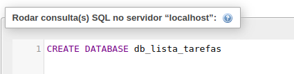
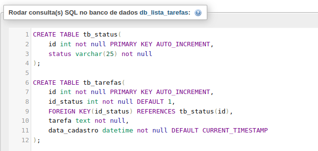
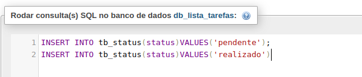
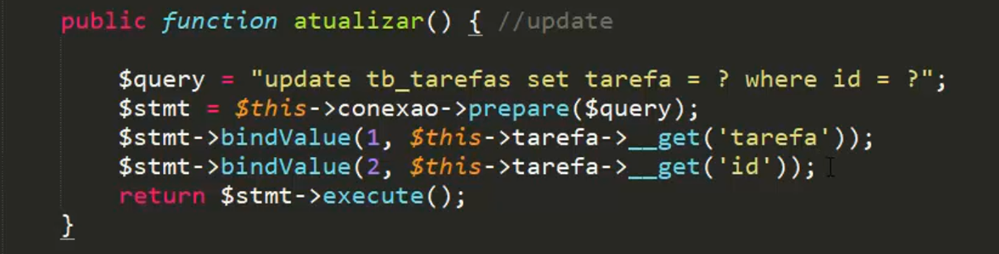
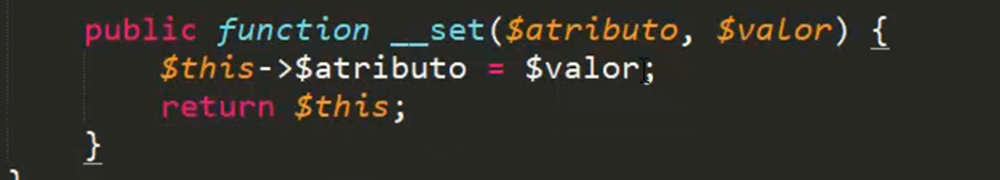
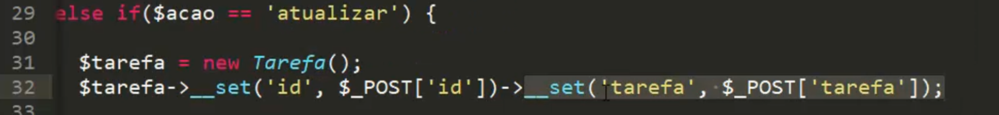

# app_lista_tarefas
PHP | PDO | MySQL project

## Tools

- [imgs](https://br.freepik.com/)
- [icons](https://ionic.io/ionicons)

## DATABASE

  
  
  

## query PREPARE - Recursos
- Podemos utilizar ? e seus indices, começando em 1  

## __set() com return
- Podemos retornar o proprio objeto $this para encadear as chamadas

